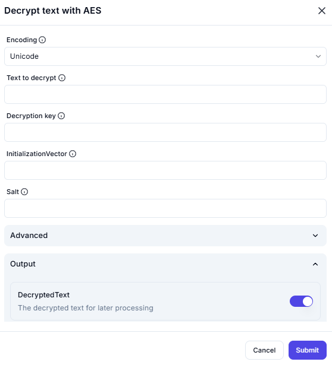

# Decrypt Text with AES

## Description

This screenshot demonstrates an interface for decrypting text that has been encrypted using the **AES (Advanced Encryption Standard)** algorithm. Users can input the encrypted text, specify a decryption key, and configure advanced settings such as encoding, initialization vector (IV), and salt.

---

## Configuration

### Encoding

- **Option**: Select the encoding type (e.g., Unicode).

### Text to Decrypt

- **Field**: Enter the encrypted text you want to decrypt.

### Decryption Key

- **Field**: Provide the decryption key used for the AES algorithm.

### Advanced Settings

- **Initialization Vector (IV)**: Specify the IV used during encryption (if applicable).
- **Salt**: Provide the salt value used during encryption (if applicable).

---

## Output

- **DecryptedText**: The resulting decrypted text, ready for further processing.

---

## Summary

This tool is useful for securely decrypting text that has been encrypted using the AES algorithm. It provides options for encoding, decryption key input, and advanced settings like initialization vector and salt for accurate decryption.
