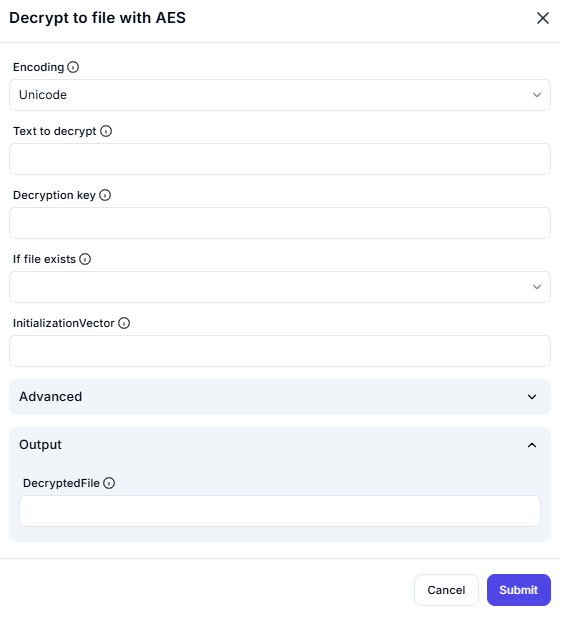

# Decrypt to File with AES

## Description

This screenshot demonstrates an interface for decrypting text and saving the decrypted content to a file using the **AES (Advanced Encryption Standard)** algorithm. Users can input the encrypted text, specify a decryption key, and configure advanced settings such as encoding, initialization vector (IV), and handling of existing files.

---

## Configuration

### Encoding

- **Option**: Select the encoding type (e.g., Unicode).

### Text to Decrypt

- **Field**: Enter the encrypted text you want to decrypt.

### Decryption Key

- **Field**: Provide the decryption key used for the AES algorithm.

### If File Exists

- **Option**: Specify what to do if the output file already exists (e.g., overwrite, append, or cancel).

### Advanced Settings

- **Initialization Vector (IV)**: Specify the IV used during encryption (if applicable).

---

## Output

- **DecryptedFile**: The resulting decrypted content saved to a file.

---

## Summary

This tool is useful for securely decrypting text and saving the decrypted content to a file using the AES algorithm. It provides options for encoding, decryption key input, and advanced settings like initialization vector and file handling for accurate decryption and file management.
