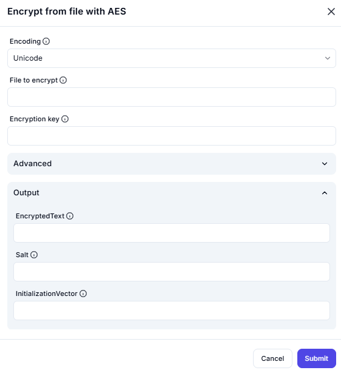

# Encrypt from File with AES

## Description

This screenshot demonstrates an interface for encrypting the contents of a file using the **AES (Advanced Encryption Standard)** algorithm. Users can select a file, specify an encryption key, and configure advanced settings such as encoding, salt, and initialization vector (IV).

## Configuration

### Encoding

- **Option**: Select the encoding type (e.g., Unicode).

### File to Encrypt

- **Field**: Choose the file you want to encrypt.

### Encryption Key

- **Field**: Provide the encryption key used for the AES algorithm.

### Advanced Settings

- **Salt**: Optional field to add a salt value for additional security.
- **Initialization Vector (IV)**: Optional field to specify an IV for the encryption process.

---

## Output

- **EncryptedText**: The resulting encrypted content from the file.
- **Salt**: The salt value used (if provided).
- **InitializationVector**: The IV used (if provided).

---

## Summary

This tool is useful for securely encrypting file contents using the AES algorithm. It provides options for encoding, encryption key input, and advanced settings like salt and initialization vector for enhanced security.
