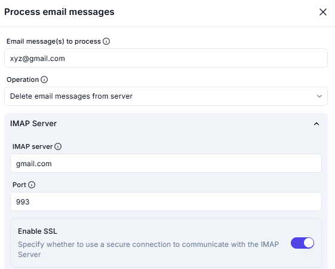

# Process Email Messages

## **Description**

This interface allows users to **process email messages** by performing operations such as deleting emails from the server. The user specifies the email account, operation type, and IMAP server details.



---

## **Input Fields**

### **1. Email Message(s) to Process**

- A text input field to specify the email address whose messages need to be processed.
- **Value:** `user@example.com`

### **2. Operation**

- A dropdown menu to select the action to perform on the email messages.
- **Selected Operation:**

```plaintext
Delete email messages from server
Mark email messages as unread
Move email messages to mail folder
Mark email messages as unread and move to mail folder
```

---

## **IMAP Server Settings**

### **3. IMAP Server**

- A text input field for specifying the IMAP server.
- **Value:** `gmail.com`

### **4. Port**

- A text input field for specifying the server port.
- **Value:** `993`

### **5. Enable SSL**

- A toggle switch to enable or disable a secure SSL connection for email retrieval.
- **Status:** **Enabled** (Toggle is switched on)
- **Description:** "Specify whether to use a secure connection to communicate with the IMAP Server."

---

## **Summary**

This tool allows users to **process emails** by selecting operations like deleting messages from the server. The configuration includes **IMAP server settings**, **port number**, and **SSL encryption** for a secure connection.
