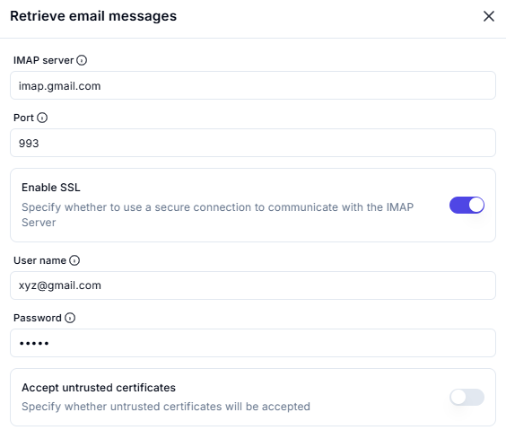
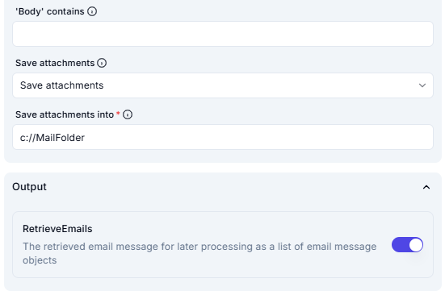

# Retrieve Email Messages

## **Description**

This screenshot displays an interface for retrieving email messages using an IMAP server. Users can configure the email server settings, authentication credentials, and security options.

---

## **Input Fields**

### **1. IMAP Server**

- A text input field for specifying the IMAP server address.
- The provided value: `imap.gmail.com`.

### **2. Port**

- A numeric input field for specifying the port number used for IMAP communication.
- The provided value: `993`.

### **3. Enable SSL**

- A toggle switch to enable or disable **SSL encryption** for secure email communication.
- This option is **enabled** in the screenshot.
- Description: "Specify whether to use a secure connection to communicate with the IMAP Server."

### **4. User Name**

- A text input field for specifying the email username.
- The provided value: `user@example.com`.

### **5. Password**

- A password input field for entering the email account password.
- The password is hidden for security.

### **6. Accept Untrusted Certificates**

- A toggle switch to specify whether untrusted SSL certificates should be accepted.
- This option is **disabled** in the screenshot.
- Description: "Specify whether untrusted certificates will be accepted."

## **Email Filters**

### **1. Mail Folder**

- A text input field to specify the folder from which emails should be retrieved.
- The selected value: `Inbox`.

### **2. Retrieve**

- A dropdown menu to select which emails to retrieve.
- The selected value: `Unread email messages only`.

### **3. Mark as Read**

- A toggle switch that determines whether retrieved messages should be marked as **read**.
- This option is **enabled** in the screenshot.
- Description: "Specify whether to mark as read the retrieved messages or leave them as is."

---

## **Filtering Criteria**

### **4. 'From' Field Contains**

- A text input field to filter emails by sender.
- The provided value: `user@example.com`.

### **5. 'To' Field Contains**

- A text input field to filter emails by recipient.
- The provided value: `user@example.com`.

### **6. 'Subject' Contains**

- A text input field to filter emails based on the subject line.
- The provided value: `ProjectDeadline`.

### **7. 'Body' Contains**

- A text input field to filter emails based on content within the email body.
- This field is **empty** in the screenshot.

## **Attachment Handling**

### **8. Save Attachments**

- A dropdown menu to specify whether attachments should be saved.
- The selected value: `Save attachments`.

### **9. Save Attachments Into**

- A text input field to specify the directory where email attachments should be saved.
- The provided value: `c://MailFolder`.

---

## **Output**

### **10. RetrieveEmails**

- A toggle switch that determines whether retrieved emails should be stored for further processing.
- This option is **enabled** in the screenshot.
- Description: "The retrieved email message for later processing as a list of email message objects."

---

## **Summary**

This tool is designed to retrieve email messages by connecting to an **IMAP server** using the provided credentials and security settings. Users can enable SSL for secure communication and decide whether to accept untrusted certificates.
