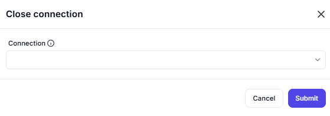

# Close Connection

## Description

This screenshot demonstrates an interface for closing an active connection, such as an FTP, SFTP, or terminal session. Users can select the connection to close and confirm the action.

---

## Configuration

### Connection

- **Field**: Select the active connection to close.

---

## Summary

This tool is useful for managing active connections by closing them when they are no longer needed. It ensures proper cleanup and resource management in workflows involving remote connections.