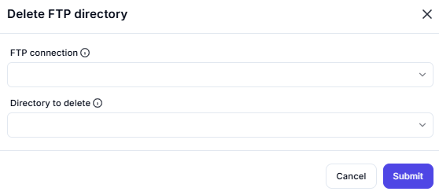

# **Delete FTP Directory**

## Description

The **Delete FTP Directory** operation allows users to remove a specified directory from an FTP server.

---

## **Input Parameters**

| Parameter          | Description                                     | Example Value             |
|-------------------|-----------------------------------------------|---------------------------|
| **FTP Connection** | The handle for an active FTP session.         | `FTP_Connection_1`        |
| **Directory to delete** | The full path of the directory to remove. | `/public/uploads/temp/`   |

---

## **Process Flow**

1. A **valid FTP connection** is selected.
2. The **directory path** to be deleted is specified.
3. The system attempts to **delete the directory** on the FTP server.
4. If the deletion is **successful**, a confirmation message is displayed.
5. If the operation **fails**, an error message is returned.

---

## **Expected Output**

| Parameter      | Description                                    |
|---------------|------------------------------------------------|
| **Success Message** | Confirms that the directory was deleted. |
| **Error Message**   | If deletion fails, an error message is shown. |

---

## **Example Use Cases**

### ✅ **1. Successfully Deleting a Directory**

#### **Input:**

FTP Connection: FTP_Connection_1 Directory to delete: /public/uploads/temp/

#### **Expected Output:**

Success: Directory '/public/uploads/temp/' has been deleted.

## **Summary**

- The **Delete FTP Directory** operation removes a **specified folder** from an FTP server.
- Requires a **valid FTP connection** and an **existing directory path**.
- If successful, the directory is **deleted**.
- If failed, an **error message is returned**.
- Useful for **cleaning up unused or temporary directories** on FTP servers.

---

✅ **Use this operation to efficiently manage and delete directories on your FTP server!** 🚀
