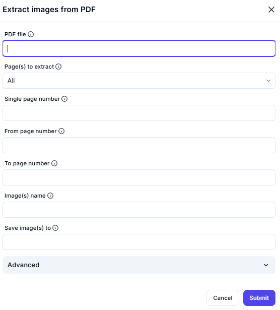

# Extract Images from PDF  

## **Description**

This interface allows users to extract images from a PDF document and save them to a specified location.

---

## PDF File

**(Required)** Upload the PDF file from which you want to extract images.

---

## Page(s) to Extract

Select the pages from which images should be extracted.  
[Dropdown: All, Single Page, Page Range]

- **All** – Extracts images from the entire document.  
- **Single Page** – Extracts images from a specific page.  
- **Page Range** – Extracts images from a defined range of pages.  

---

## From Page Number / To Page Number

Define a range of pages to extract images from.  
From: [] (Enter Start Page) To: [] (Enter End Page)

---

## Image(s) Name

Specify the name format for the extracted images.  
(Enter image name format)

yaml
Copy
Edit

---

## Save Image(s) To

Define the directory or folder where extracted images will be saved.  
(Enter save location)

---

**🔔 Note:** Ensure the PDF contains images suitable for extraction.
