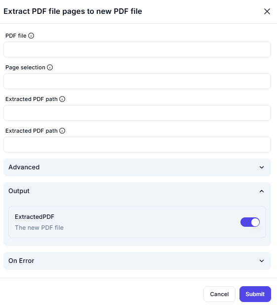

# Extract PDF File Pages to New PDF File  

## **Description**

This interface allows users to extract specific pages from a PDF and save them as a new PDF file.

---

## PDF File

**(Required)** Upload the PDF file from which you want to extract pages.  

---

## Page Selection

Specify the pages you want to extract.  
(Enter page numbers or range)

**Example:**

- `1,3,5` (Extracts pages 1, 3, and 5)  
- `2-6` (Extracts pages from 2 to 6)  
- `All` (Extracts all pages)  

---

## Extracted PDF Path

Define where the new PDF file should be saved.  
(Enter save location)

## Output

Enable this option to generate the new PDF file.  
[✔] ExtractedPDF – The new PDF file

---

**🔔 Note:** Ensure the selected page numbers are valid for the uploaded PDF.
