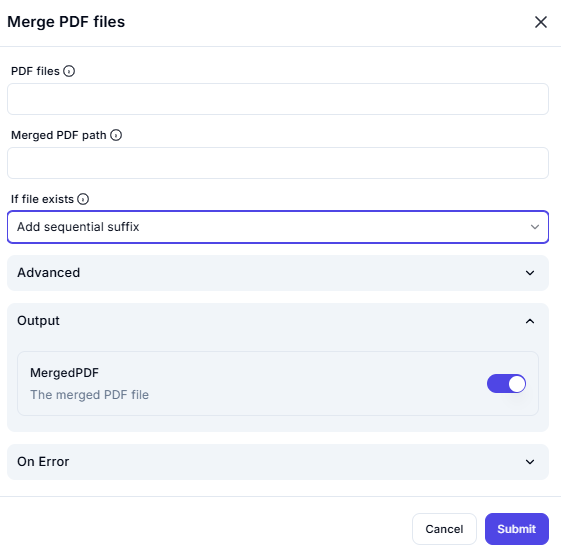

# 📑 Merge PDF Files  

## **Description**

This interface allows users to merge multiple PDF files into a single document.

---

## PDF Files

**(Required)** Select or upload multiple PDF files to merge.  

---

## Merged PDF Path

Specify where to save the merged PDF file.  
(Enter save location)

---

## If File Exists

Choose how to handle file conflicts if the merged file already exists.  

**Options:**

- Overwrite existing file  
- Add sequential suffix  
- Skip merging  

---

## Output

Enable this option to generate the merged PDF file.  
[✔] MergedPDF – The merged PDF file

---

**🔔 Note:** Ensure the selected PDF files are valid and in the correct order before merging.
