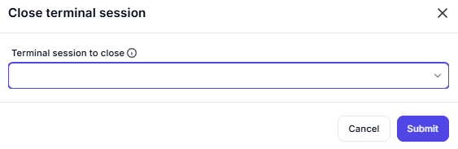

# Close Terminal Session

## Description

This screenshot demonstrates an interface for closing an active terminal session. Users can select the terminal session they want to close and confirm the action.

---

## Configuration

### Terminal Session to Close

- **Field**: Select the terminal session you want to close.

---

## Summary

This tool is useful for managing terminal sessions, allowing users to close active sessions when they are no longer needed. It ensures proper cleanup and resource management in terminal emulation environments.
