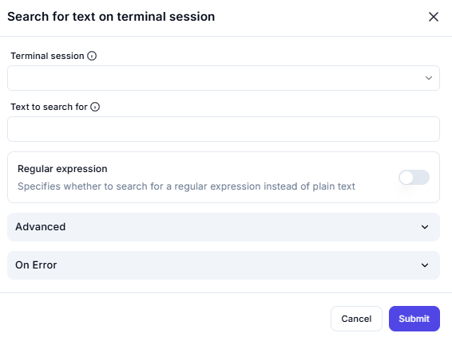

# Search for Text on Terminal Session

## Description

This screenshot demonstrates an interface for searching for specific text within an active terminal session. Users can specify the text to search for, whether it’s a regular expression or plain text, and configure advanced settings if needed.

---

## Configuration

### Terminal Session

- **Field**: Select the terminal session where the search will be performed.

### Text to Search For

- **Field**: Enter the text or regular expression to search for.

### Regular Expression

- **Option**: Specify whether the text is a regular expression (e.g., enable for pattern matching).

### Advanced

- **Option**: Configure additional settings for the search (e.g., case sensitivity, search direction).

---

## Summary

This tool is useful for locating specific text within a terminal session, whether it’s plain text or a regular expression. It supports advanced configurations, making it ideal for automating tasks and debugging in terminal-based applications.
