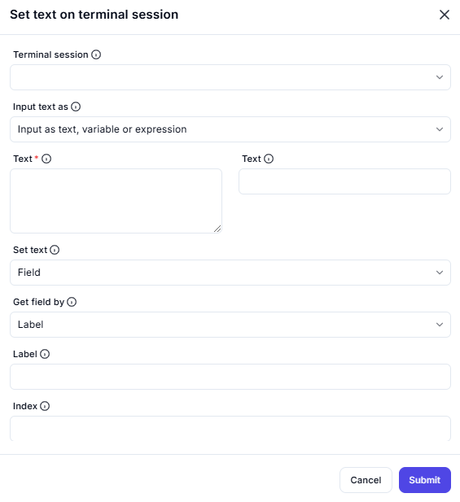

# Set Text on Terminal Session

## Description

This screenshot demonstrates an interface for setting or updating text in an active terminal session. Users can input text directly, use a variable, or provide an expression to set the text in a specific field.



---

## Configuration

### Terminal Session

- **Field**: Select the terminal session where the text will be set.

### Input Text As

- **Option**: Choose how to input the text (e.g., as text, variable, or expression).

### Text

- **Field**: Enter the text, variable, or expression to set in the terminal session.

### Set Text

- **Option**: Specify where to set the text (e.g., in a `Field`).

### Get Field By

- **Option**: Choose how to identify the field (e.g., by `Label`).

### Label

- **Field**: Enter the label associated with the field (if applicable).

### Index

- **Field**: Specify the index of the field (if applicable).

---

## Example

## Scenario

You need to update a specific field in a terminal session with the text `"USER123"`. The field is identified by the label `"Username"`.

---

### Eg. Terminal Session

- **Field**: Select the terminal session (e.g., `MainframeSession`).

### Eg. Input Text As

- **Option**: `Text` (direct input).

### Eg. Text

- **Field**: Enter the text: USER123

### Eg. Set Text

- **Option**: `Field`.

### Eg. Get Field By

- **Option**: `Label`.

### Eg. Label

- **Field**: Enter the label: Username

### Eg. Index

- **Field**: Leave blank (not required for this example).

---

### Eg. Actions

- **Submit**: Confirm and set the text `"USER123"` in the field labeled `"Username"`.

---

## Example Code (Pseudocode)

```plaintext
# Set Text in Terminal Session
TerminalSession session = GetSession("MainframeSession");
session.SetText(
  InputType: "Text",
  Text: "USER123",
  FieldIdentifier: "Label",
  Label: "Username"
);
```

## Summary

This tool is useful for updating or setting text in a terminal session, whether directly or through variables/expressions. It provides flexibility in defining the text source and target field, making it ideal for automating interactions with terminal-based applications.
