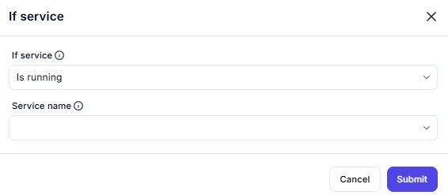

# If Service  

## **Description**

This interface allows users to check the status of a service before performing an action.

---

Select the condition to check for the service.

**Options:**

- Is running
- Is stopped
- Is installed
- Isn't installed
- Is running
- Is paused

---

## Service Name

Specify the name of the service to check.

**🔔 Note:** Ensure the service name is correctly entered to avoid errors.
