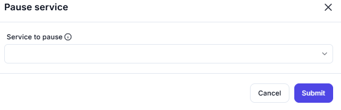

# Pause Service

## Description

This screenshot demonstrates an interface where users can pause a specific service. The interface provides options to specify the service and confirm the action.

---

## Configuration

### Service to Pause

- **Field**: Enter the name of the service you want to pause.

---

## Summary

This tool is useful for managing services, allowing users to pause a specific service with a simple interface. It ensures that the correct service is targeted and paused as needed.
