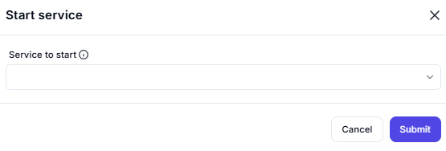

# Start Service

## Description

This screenshot demonstrates an interface where users can start a specific service. The interface provides options to specify the service and confirm the action.

---

## Configuration

### Service to Start

- **Field**: Enter the name of the service you want to start.

---

## Summary

This tool is useful for managing services, allowing users to start a specific service with a simple interface. It ensures that the correct service is targeted and started as needed.
