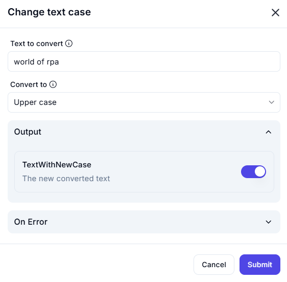

# **Change Text Case**

## **Description**

The **Change Text Case** operation modifies the letter case of a given text string. It allows conversion into **Upper Case, Lower Case, Title Case, or Sentence Case** for formatting consistency in text processing.

---

## **Input Parameters**

| Parameter         | Value                        | Description |
|------------------|----------------------------|-------------|
| **Text to Convert** | `world of rpa`   | The original text to be converted. |
| **Convert to** | `Upper case` | Specifies the type of case transformation. |

---

## **Output**

| Parameter      | Description |
|---------------|-------------|
| **TextWithNewCase** | The text with the selected case transformation applied. |

---

## **Effect**

- **Standardizes text formatting** across applications.
- **Enhances readability** for titles, reports, and user interfaces.
- **Improves data processing** by ensuring case uniformity.

---

## **Example Use Cases**

### **Example 1: Converting to Upper Case**

#### **Scenario**

You want to convert a sentence to **uppercase** for emphasis.

#### **Configuration**

- **Text to Convert:** `"world of rpa"`
- **Convert to:** `Upper case`

#### **Result :** `WORLD OF RPA`
