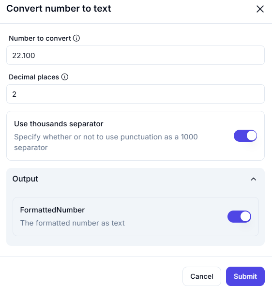

# **Convert Number to Text**

## **Description**

The **Convert Number to Text** operation formats numerical values into a **text string** while allowing custom decimal precision and thousands separators.

---

## **Input Parameters**

| Parameter              | Value         | Description |
|-----------------------|--------------|-------------|
| **Number to Convert** | `22.100`      | The original number to be converted. |
| **Decimal Places**    | `2`           | Defines the number of decimal places in the output. |
| **Use Thousands Separator** | `Enabled` | Determines whether a **comma (`,`) or dot (`.`)** is used as a **thousands separator**. |

---

## **Output**

| Parameter           | Description |
|--------------------|-------------|
| **FormattedNumber** | The number converted into a formatted text string. |

---

## **Effect**

- **Standardizes numerical formatting** for display or further processing.
- **Ensures precision control** by defining decimal places.
- **Enhances readability** with thousands separators.

---

## **Example Use Cases**

### **Example 1: Formatting with Decimal Places**

#### **Scenario**

You need a **formatted number** with two decimal places.

#### **Configuration**

- **Number to Convert:** `22.100`
- **Decimal Places:** `2`
- **Use Thousands Separator:** `Disabled`

#### **Result :** `22.10`
