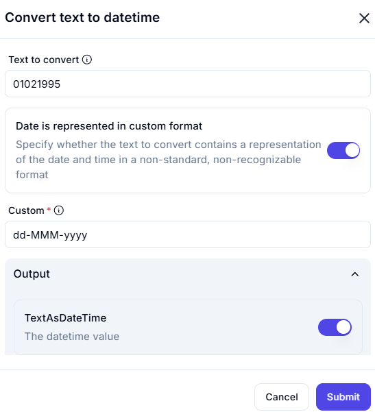

# **Convert Text to Datetime**

## **Description**
The **Convert Text to Datetime** operation takes a text-based date representation and transforms it into a **valid datetime format**. This is useful when working with **non-standard date formats**.

---

## **Input Parameters**

| Parameter                             | Value        | Description |
|---------------------------------------|-------------|-------------|
| **Text to Convert**                   | `01021995`  | The input text containing a date in a **custom format**. |
| **Date is Represented in Custom Format** | `Enabled`  | Specifies that the input follows a **non-standard date format**. |
| **Custom Format**                      | `dd-MMM-yyyy` | The format that interprets the given text into a valid date. |

---

## **Output**

| Parameter        | Description |
|-----------------|-------------|
| **TextAsDateTime** | The converted text in a valid **datetime format**. |

---

## **Effect**
- **Converts text-based dates** into **structured** datetime objects.
- **Ensures compatibility** with date-based operations.
- **Handles custom date formats**, which are not automatically recognized.

---

## **Example Use Cases**

### **Example 1: Converting a Simple Date String**

#### **Scenario**

You need to convert `01021995` into a **structured date format**.

#### **Configuration**

- **Text to Convert:** `01021995`
- **Custom Format:** `dd-MMM-yyyy`

#### **Result :** `01-Feb-1995`
