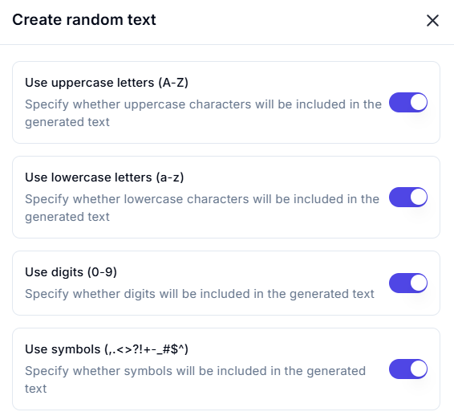
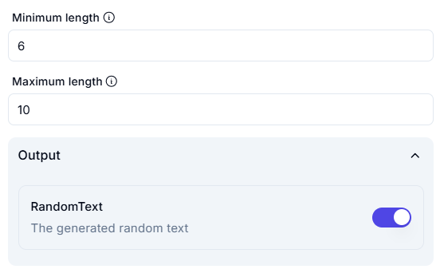

# **Create Random Text**

## **Description**

The **Create Random Text** operation generates a random sequence of characters based on user-defined preferences, including-

- **Character types (uppercase, lowercase, digits, symbols)**

- **Length constraints (minimum and maximum length)**

---

## **Configuration Options**

| Parameter                           | Status  | Description |
|-------------------------------------|---------|-------------|
| **Use Uppercase Letters (A-Z)**    | ✅ Enabled  | Includes uppercase letters in the generated text. |
| **Use Lowercase Letters (a-z)**    | ✅ Enabled  | Includes lowercase letters in the generated text. |
| **Use Digits (0-9)**               | ✅ Enabled  | Includes numerical digits (0-9) in the generated text. |
| **Use Symbols (.,<>?!+–_$#^)**     | ✅ Enabled  | Includes special characters and symbols in the generated text. |
| **Minimum Length**                 | `6`     | Sets the shortest possible generated text length. |
| **Maximum Length**                 | `10`    | Sets the longest possible generated text length. |

---

## **Effect**

- Generates a **randomized** text string.
- Ensures **character diversity** based on selected options.
- Allows **custom length control** for different applications.

---

## **Example Use Cases**

### **Example 1: Generating a Secure Password**

#### **Configuration**

- **Include Uppercase Letters:** ✅ Yes
- **Include Lowercase Letters:** ✅ Yes
- **Include Digits:** ✅ Yes
- **Include Symbols:** ✅ Yes
- **Minimum Length:** `8`
- **Maximum Length:** `12`

#### **Generated Output :** `Xz8#fL1!k@9P`

