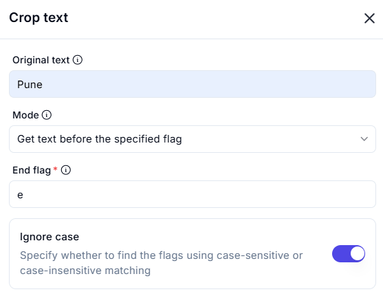
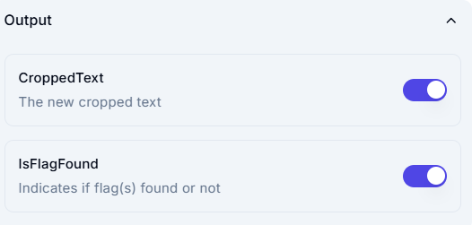

# **Crop Text**

## **Description**

This operation extracts a portion of text from the original string based on a specified flag.

## **Input Parameters**

| Parameter        | Value        | Description |
|-----------------|-------------|-------------|
| **Original Text** | `Pune`      | The full text from which a substring will be extracted. |
| **Mode**        | `Get text before the specified flag` | Defines how the text will be cropped. |
| **End Flag**    | `e`          | The character or substring that acts as a stopping point for extraction. |
| **Ignore Case** | `Enabled`    | Allows case-insensitive flag matching. |

## **Output**

| Parameter   | Description |
|------------|-------------|
| **Cropped Text** | Get text before the specified flag. |
| **Cropped Text** | Get text after the specified flag. |
| **Cropped Text** | Get the text between two specified flag. |

## **Effect**

- Extracts text **before a specified character or substring**.
- Helps in **text parsing, preprocessing, and string manipulation**.

## **Example Use Case**

- **Scenario:** A user wants to extract text **before** the character `"e"` from the word `"Pune"`.

- **Configuration:**
  - Original Text: `Pune`
  - Mode: `Get text before the specified flag`
  - End Flag: `e`
  - Ignore Case: `Enabled`
- **Result:** The output will be: Pun
