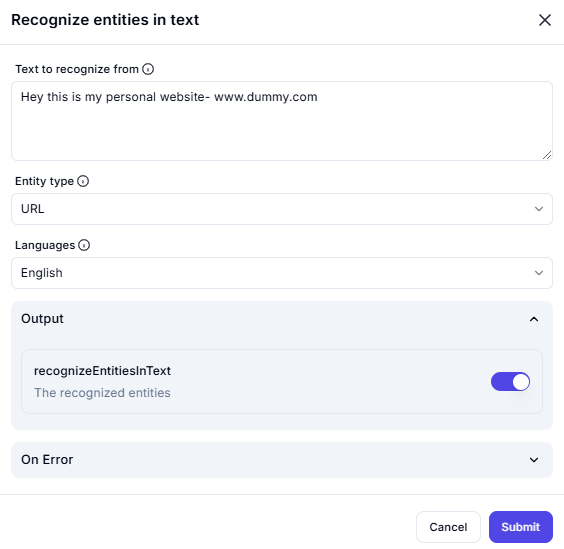

# Recognize Entities in Text

## Description

This screenshot demonstrates a tool or interface designed to recognize specific entities (such as URLs) within a given text. The example provided extracts a URL from a text input.

---


## Input

- **Text to Recognize**:

```
Hey this is my personal website www.dummy.com
```

- **Entity Type**:
- **URL**

- **Languages**:
- **English**

---

## Output

- **Recognized Entities**:
- **URL**: `www.dummy.com`

---

## Actions

- **On Error**: Handle errors during the recognition process.
- **Buttons**:
- **Cancel**: Abort the operation.
- **Submit**: Confirm and process the text.

---

## Summary

This tool is useful for extracting specific entities (like URLs) from text, making it easier to analyze or process information programmatically.
