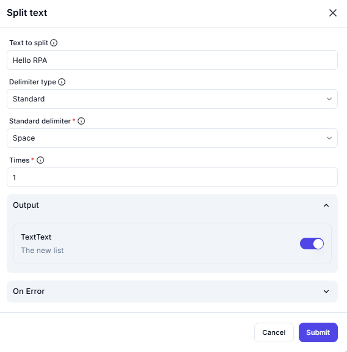

# **Split Text Operation**

## **Description**

The **Split Text** operation breaks a given string into a list of substrings based on a specified delimiter.


---

## **Configuration Options**

| Parameter                 | Value       | Description |
|---------------------------|------------|-------------|
| **Text to split**         | `Hello RPA` | The input text that needs to be split. |
| **Delimiter type**        | `Standard`  | Specifies the delimiter category. |
| **Standard delimiter**    | `Space`     | The chosen delimiter to split the text. |
| **Times**                 | `1`         | Number of times to apply the split operation. |

---

## **Effect**

- **Splits** the input text **"Hello RPA"** into a list based on the **space delimiter**.
- The operation is executed **once** due to `Times = 1`.

---

## **Example Use Cases**

### **Example 1: Splitting a Simple Phrase**

#### **Input**

```plaintext
Hello RPA
```

#### **Output**

```plaintext
["Hello", "RPA"]

The split text is stored in:
```

### **Output Variable**: TextText

### **Format**: A list containing the separated substrings.