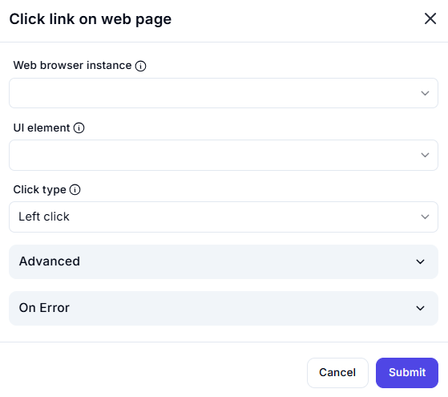

# Click Link on Web Page  

## Description

This action automates clicking on a specific link on a web page within a specified browser instance.  
It is useful for web automation tasks such as navigation, form submission, and interaction with web elements.  

  

## Fields and Options  

### 1. **Web Browser Instance** 🛈

- Select the active browser instance where the action should take place.  
- Ensures interaction occurs in the correct web session.  

### 2. **UI Element** 🛈

- Specify the UI element (link) to be clicked.  
- The element can be identified using selectors like XPath, CSS, or attributes.  

### 3. **Click Type** 🛈

- Choose the type of click action:  
  - **Left click** (default)  
  - **Right click**  
  - **Double click**  
- Allows flexibility depending on the type of interaction required.  

### 4. **Advanced Settings**

- Additional configurations for click behavior.  

### 5. **On Error**

- Defines what action to take if the click fails.  

## Use Cases

- Navigating to different sections of a website.  
- Clicking buttons, links, or interactive elements on web pages.  
- Automating repetitive web tasks such as form submissions.  

## Summary

The **Click Link on Web Page** action enables seamless automation of web interactions.  
It provides precise control over link clicking, enhancing efficiency in browser automation.  
