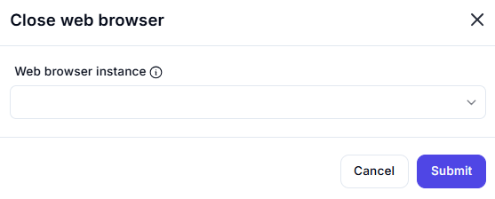

# Close Web Browser  

## Description

This feature allows users to close a specific web browser instance. It is useful for cleaning up resources and ensuring that browser sessions are properly terminated after automation tasks.  

  

## Fields and Options  

### 1. **Web Browser Instance** 🛈

- **Description**: Select the web browser instance to close.  
- **Purpose**: This ensures the correct browser session is terminated.  

## Use Cases

- **Resource Cleanup**: Closing browser instances to free up system resources after automation tasks.  
- **Session Management**: Ensuring that browser sessions are properly terminated to avoid memory leaks.  
- **Workflow Completion**: Closing browsers at the end of an automation workflow.  

## Summary

The **Close Web Browser** action provides a way to close a specific web browser instance. It ensures proper cleanup of resources and termination of browser sessions, making it essential for efficient automation workflows.  
