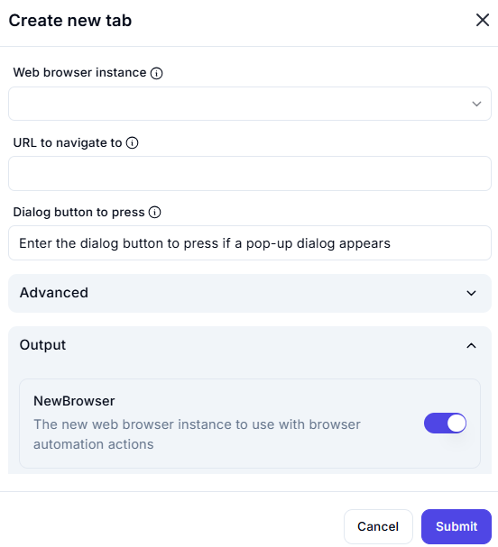

# Create New Tab  

## Description

This feature allows users to open a new tab in an existing web browser instance and navigate to a specified URL.  
It is useful for automating web-based workflows without opening a completely new browser window.  

  

## Fields and Options  

### 1. **Web Browser Instance** 🛈

- Select the browser instance where the new tab should be opened.  
- This ensures the new tab is created within the correct automation session.  

### 2. **URL to Navigate To** 🛈

- Specify the URL to open in the new tab.  
- Example: `https://www.google.com`  

### 3. **Dialog Button to Press** 🛈

- If a pop-up dialog appears when opening the tab, enter the button to press (e.g., "OK" or "Cancel").  
- This helps in handling unexpected alerts that may interrupt automation.  

### 4. **Advanced**

- Additional settings for fine-tuning browser automation behavior.  

### 5. **Output: NewBrowser** 🛈

- A toggle option that, when enabled, stores the new browser instance for later automation steps.  
- This instance can be referenced in subsequent web automation actions.  

## Use Cases

- Opening multiple web pages for automated data extraction.  
- Logging into different websites in separate tabs.  
- Automating workflows that require interaction with multiple web pages.  

## Summary

The **Create New Tab** action is a powerful automation feature that streamlines web-based tasks.  
It enables users to efficiently manage browser tabs and automate navigation seamlessly.  
