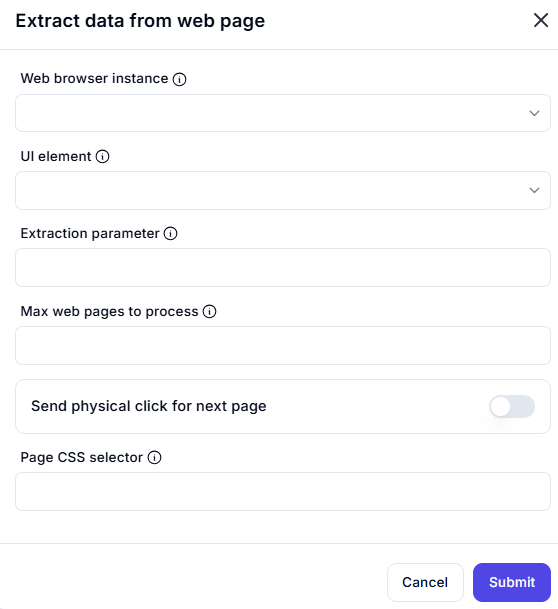

# Extract Data from Web Page  

## Description

This feature allows users to extract data from a web page using a web browser instance and specific UI elements. It supports advanced options like pagination and CSS selectors for precise data extraction.  

  

## Fields and Options  

### 1. **Web Browser Instance** 🛈

- Select the web browser instance from which to extract data.  
- This ensures the action is performed on the correct browser session.  

### 2. **UI Element** 🛈

- Specify the UI element on the web page from which to extract data (e.g., table, list, text).  

### 3. **Extraction Parameter** 🛈

- Define the type of data to extract (e.g., text, attribute, HTML content).  

### 4. **Max Web Pages to Process** 🛈

- Set the maximum number of web pages to process (e.g., for paginated data).  

### 5. **Send Physical Click for Next Page** 🛈

- Enable this option to simulate a physical click for navigating to the next page (e.g., for pagination).  

### 6. **Page CSS Selector** 🛈

- Specify the CSS selector for identifying the next page button or element (e.g., `.next-page`, `#next-button`).  

## Use Cases

- Extracting data from tables, lists, or specific elements on a web page.  
- Automating data collection from paginated web pages.  
- Scraping dynamic content from websites for analysis or storage.  

## Summary

The **Extract Data from Web Page** action provides a way to extract data from web pages using a web browser instance and specific UI elements. It supports advanced features like pagination and CSS selectors, making it ideal for web scraping and data collection tasks.
