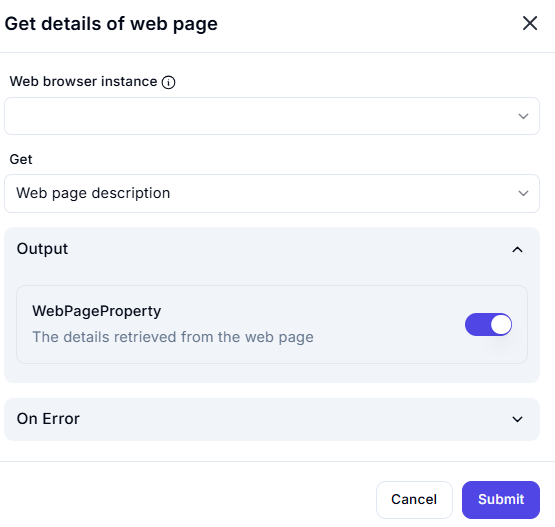

# Get Details of Web Page  

## Description

This feature allows users to retrieve specific details from a web page, such as the page description, title, or other metadata. It is useful for extracting key information from web pages during automation workflows.  

  

## Fields and Options  

### 1. **Web Browser Instance** 🛈

- Select the web browser instance from which to retrieve the web page details.  
- This ensures the action is performed on the correct browser session.  

### 2. **Get** 🛈

- Choose the type of details to retrieve from the web page:  
  - **Web Page Description**: Retrieve the meta description of the web page.  
  - **Web Page Title**: Retrieve the title of the web page.  
  - **Other Metadata**: Retrieve additional metadata (if applicable).  

### 3. **Output: WebPageProperty** 🛈

- Retrieves the details of the web page based on the selected option (e.g., description, title).  

## Use Cases

- Extracting metadata (e.g., title, description) from web pages for analysis or logging.  
- Automating workflows that require web page details for decision-making.  
- Collecting information for reporting or documentation purposes.  

## Summary

The **Get Details of Web Page** action provides a way to retrieve specific details from a web page, such as the description or title. It ensures accurate extraction of key information, making it ideal for web automation and data collection tasks.
