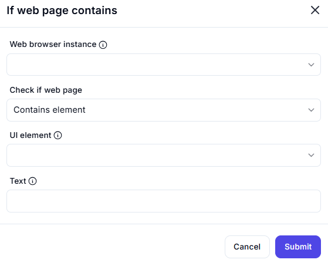

# If Web Page Contains  

## Description

This feature allows users to check if a web page contains a specific UI element or text. It is useful for conditional logic in automation workflows, where actions depend on the presence of certain elements or text on the page.  

  

## Fields and Options  

### 1. **Web Browser Instance** 🛈

- Select the web browser instance where the check will be performed.  
- This ensures the action is performed on the correct browser session.  

### 2. **Check If Web Page** 🛈

- Choose what to check for on the web page:  
  - **Contains Element**: Check if a specific UI element is present.  
  - **Contains Text**: Check if specific text is present on the page.  

### 3. **UI Element** 🛈

- Specify the UI element to check for (if checking for an element).  

### 4. **Text** 🛈

- Enter the text to check for (if checking for text).  

## Use Cases

- Implementing conditional logic in automation workflows based on the presence of elements or text.  
- Validating that a web page has loaded correctly by checking for specific elements.  
- Triggering actions only if certain text or elements are present on the page.  

## Summary

The **If Web Page Contains** action provides a way to check if a web page contains a specific UI element or text. It enables conditional logic in automation workflows, ensuring actions are performed only when certain conditions are met.
