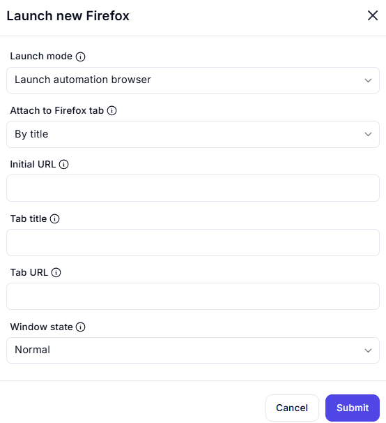

# Launch New Firefox  

## Description

This feature allows users to launch a new instance of Firefox or attach to an existing tab. It includes options to configure the launch mode, initial URL, tab title, and window state.  

  

## Fields and Options  

### 1. **Launch Mode** 🛈

- Choose how to launch Firefox:  
  - **Launch Automation Browser**: Launch a new instance of Firefox for automation.  
  - **Attach to Firefox Tab**: Attach to an existing Firefox tab.  

### 2. **Attach to Firefox Tab** 🛈

- Specify how to identify the tab to attach to:  
  - **By Title**: Attach to a tab based on its title.  
  - **By URL**: Attach to a tab based on its URL.  

### 3. **Initial URL** 🛈

- Enter the URL to load when launching a new instance of Firefox.  

### 4. **Tab Title** 🛈

- Specify the title of the tab to attach to (if attaching by title).  

### 5. **Tab URL** 🛈

- Specify the URL of the tab to attach to (if attaching by URL).  

### 6. **Window State** 🛈

- Choose the initial state of the Firefox window:  
  - **Normal**: Open the window in its default state.  
  - **Maximized**: Open the window in a maximized state.  
  - **Minimized**: Open the window in a minimized state.  

## Use Cases

- Launching a new instance of Firefox for automation tasks.  
- Attaching to an existing Firefox tab to continue automation.  
- Configuring the initial URL and window state for better control over the browser session.  

## Summary

The **Launch New Firefox** action provides a way to launch or attach to Firefox with customizable options like launch mode, initial URL, tab title, and window state. It ensures flexibility and control when working with Firefox in automation workflows.
