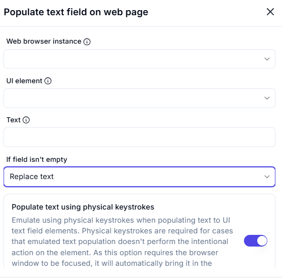
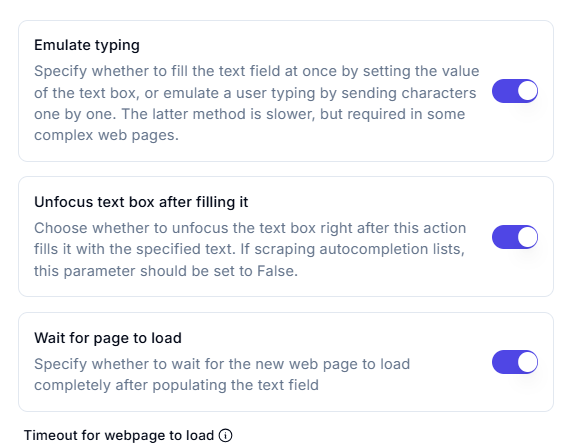
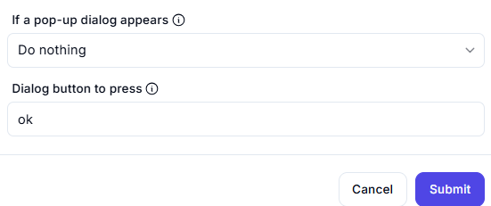

# Populate Text Field on Web Page  

## Description

This feature allows users to populate a text field (UI element) on a web page with specified text. It includes options to handle non-empty fields and emulate physical keystrokes for cases where standard text population doesn't work.  

## Fields and Options  

### 1. **Web Browser Instance** 🛈

- Select the web browser instance where the text field is located.  
- This ensures the action is performed on the correct browser session.  

### 2. **UI Element** 🛈

- Specify the text field (UI element) to populate (e.g., input field, search box).  

### 3. **Text** 🛈

- Enter the text to populate in the text field.  

### 4. **If Field Isn't Empty** 🛈

- Choose how to handle non-empty text fields:  
  - **Replace Text**: Replace the existing text with the new text.  

### 5. **Populate Text Using Physical Keystrokes** 🛈

- Enable this option to emulate physical keystrokes when populating the text field.  
- This is useful for cases where standard text population doesn't trigger the intended action on the element.  
- Note: This option requires the browser window to be focused and will bring it to the foreground automatically.  

### 6. **Emulate Typing** 🛈

- Choose how to populate the text field:  
  - **Fill at Once**: Set the value of the text box instantly.  
  - **Emulate Typing**: Send characters one by one to simulate user typing.  
    - **Note**: This method is slower but required for complex web pages where instant population doesn't work.  

### 7. **Unfocus Text Box After Filling It** 🛈

- Choose whether to unfocus the text box after filling it with text:

  - **True**: Unfocus the text box immediately after filling it.  
  - **False**: Keep the text box focused (useful for scraping autocompletion lists).  

### 8. **Wait for Page to Load** 🛈

- Enable this option to wait for the web page to load completely after populating the text field.  

### 9. **Timeout for Webpage to Load** 🛈

- Set the maximum time (in seconds) to wait for the page to load (e.g., `60` seconds).  

## Use Cases

- Automating form filling by populating text fields with specific data.  
- Handling non-empty fields by replacing existing text.  
- Using physical keystrokes for cases where standard text population fails to trigger required actions.  

## Summary

The **Populate Text Field on Web Page** action provides a way to populate text fields on web pages with specified text. It includes options to handle non-empty fields and emulate physical keystrokes, ensuring reliable and accurate text input during automation workflows.
