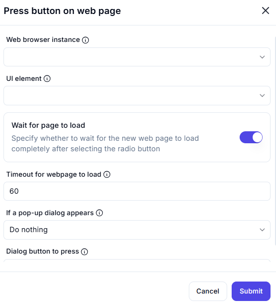

# Press Button on Web Page  

## Description

This feature allows users to press a button (UI element) on a web page within a web browser instance. It includes options to wait for the page to load and handle pop-up dialogs if they appear.  

  

## Fields and Options  

### 1. **Web Browser Instance** 🛈

- Select the web browser instance where the button is located.  
- This ensures the action is performed on the correct browser session.  

### 2. **UI Element** 🛈

- Specify the button (UI element) to press.  

### 3. **Wait for Page to Load** 🛈

- Enable this option to wait for the web page to load completely after pressing the button.  

### 4. **Timeout for Webpage to Load** 🛈

- Set the maximum time (in seconds) to wait for the page to load (e.g., `60` seconds).  

### 5. **If a Pop-up Dialog Appears** 🛈

- Choose how to handle pop-up dialogs:  
  - **Do Nothing**: Ignore the pop-up dialog.  
  - **Dialog Button to Press**: Specify a button to press on the pop-up dialog (e.g., `OK`, `Cancel`).  

## Use Cases

- Automating interactions with buttons on web pages (e.g., submit, download, or navigation buttons).  
- Ensuring the web page is fully loaded before proceeding with further actions.  
- Handling pop-up dialogs that may appear after pressing a button.  

## Summary

The **Press Button on Web Page** action provides a way to interact with buttons on web pages, with options to wait for the page to load and handle pop-up dialogs. It ensures smooth and reliable interaction with web elements during automation workflows.
