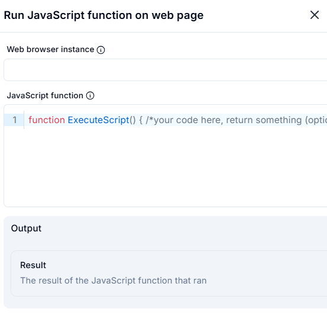

# Run JavaScript Function on Web Page  

## Description

This feature allows users to execute a custom JavaScript function on a web page within a web browser instance. It is useful for performing advanced interactions or manipulations on web pages that require custom scripting.  

  

## Fields and Options  

### 1. **Web Browser Instance** 🛈

- **Description**: Select the web browser instance where the JavaScript function will be executed.  
- **Purpose**: This ensures the action is performed on the correct browser session.  

### 2. **JavaScript Function** 🛈

- **Description**: Enter the JavaScript function to execute on the web page.  
- **Example**:  

  ```javascript

  function ExecuteScript() { 
      // Your code here
      return "Script executed successfully"; 
  }

- Purpose: Allows users to define custom logic or interactions using JavaScript.

### **3. Output: Result** 🛈

Description: Retrieves the result of the JavaScript function execution (if the function returns a value).

### **Purpose**

Provides the output of the script for further use in the workflow.

### **Use Cases**

Advanced Interactions: Performing advanced interactions with web page elements using custom JavaScript.

### **DOM Manipulation**

Manipulating the DOM (Document Object Model) of a web page dynamically.

### **Data Extraction/Modification**

Extracting or modifying data on a web page using JavaScript.

### **Summary**

The Run JavaScript Function on Web Page action provides a way to execute custom JavaScript functions on web pages. It enables advanced automation tasks that require scripting, making it ideal for complex web interactions and data manipulation.
