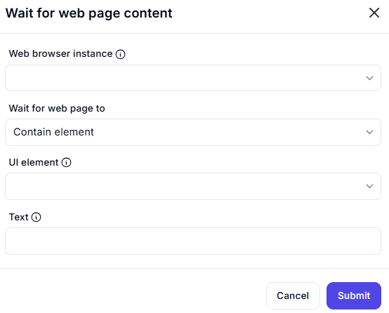

# Wait for Web Page Content  

## Description

This feature allows users to wait for specific content to appear on a web page, such as a UI element or text. It is useful for ensuring that the web page has fully loaded or that certain elements are present before proceeding with further actions.  

  

## Fields and Options  

### 1. **Web Browser Instance** 🛈

- Select the web browser instance where the wait will be performed.  
- This ensures the action is performed on the correct browser session.  

### 2. **Wait for Web Page To** 🛈

- Choose what to wait for on the web page:  
  - **Contain Element**: Wait for a specific UI element to appear.  
  - **Contain Text**: Wait for specific text to appear on the page.  

### 3. **UI Element** 🛈

- Specify the UI element to wait for (if waiting for an element).  

### 4. **Text** 🛈

- Enter the text to wait for (if waiting for text).  

## Use Cases

- Ensuring that a web page has fully loaded before performing further actions.  
- Waiting for specific elements or text to appear before proceeding with automation tasks.  
- Handling dynamic content that loads asynchronously on web pages.  

## Summary

The **Wait for Web Page Content** action provides a way to wait for specific content (elements or text) to appear on a web page. It ensures that automation workflows proceed only when the required content is available, improving reliability and accuracy.
