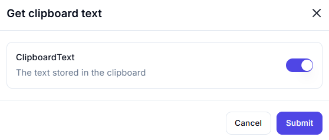

# **Get Clipboard Text**

## Description

The **Get Clipboard Text** action retrieves the text currently stored in the system clipboard.

---

## **Features & Parameters**

| Parameter      | Description                              | Example Value |
|---------------|------------------------------------------|---------------|
| **ClipboardText** | Stores the text content from the clipboard | `"Hello, World!"` |

---

## **How It Works**

1. The action fetches the text stored in the system clipboard.
2. If enabled, the **ClipboardText** variable will hold the retrieved content.
3. Click **"Submit"** to execute and retrieve the text.

---

## **Use Cases**

✔ Extracting copied text for automation tasks  
✔ Storing clipboard content for further processing  
✔ Using clipboard data as an input for scripts or workflows  

---

⚠ **Note**: Ensure that the clipboard contains text before executing this action to avoid unexpected results.
