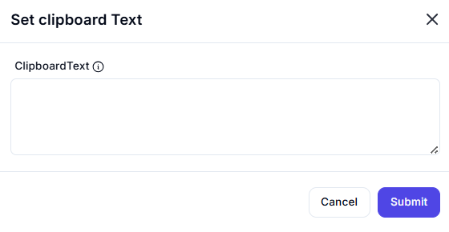

# **Set Clipboard Text**

## Description

The **Set Clipboard Text** action allows you to store custom text in the system clipboard.

---

## **Features & Parameters**

| Parameter      | Description                              | Example Value |
|---------------|------------------------------------------|---------------|
| **ClipboardText** | The text to be stored in the clipboard | `"Hello, World!"` |

---

## **How It Works**

1. Enter the text you want to store in the clipboard in the **ClipboardText** field.
2. Click **"Submit"** to execute the action.
3. The clipboard will now contain the specified text, ready to be pasted elsewhere.

---

## **Use Cases**

✔ Automating text copying for quick pasting  
✔ Storing frequently used snippets for reuse  
✔ Populating clipboard data for automated workflows  

---

⚠ **Note**: This action will replace any existing clipboard content.
