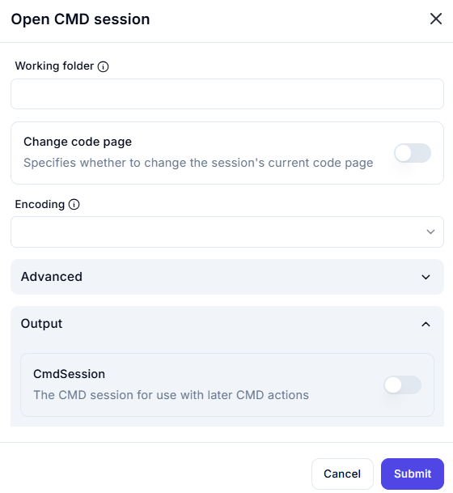

# **Open CMD Session**

## Description

The **Open CMD Session** action starts a new command-line (CMD) session, allowing execution of commands in a Windows environment.

---

## **Features & Parameters**

| Parameter | Description | Example Value |
|-----------|------------|---------------|
| **Working Folder** | The directory where the CMD session starts. | `C:\Users\Admin\Projects` |
| **Change Code Page** | If enabled, allows setting a different code page for character encoding. | ❌ Disabled |
| **Encoding** | Defines the encoding type used in the session. | `UTF-8` |
| **Advanced** | Contains additional session settings (collapsed by default). | - |
| **CmdSession (Output)** | If enabled, allows reuse of this CMD session for later actions. | ❌ Disabled |

---

## **How It Works**

1. **Set the Working Folder** – Define the directory where CMD should operate.
2. **Optional: Change Code Page** – Enable this if a different encoding is required.
3. **Select Encoding** – Choose the text encoding format (e.g., `UTF-8`, `ASCII`).
4. **Enable CmdSession (if needed)** – Use this session for later commands.
5. **Click "Submit"** to start the CMD session.

---

## **Use Cases**

✔ Running scripts from a specific directory  
✔ Setting up an environment for batch processing  
✔ Ensuring consistent encoding for text processing  
✔ Using a persistent CMD session for multiple commands  
