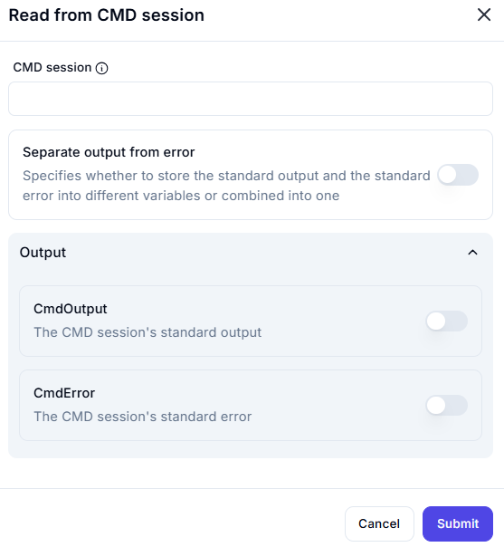

# **Read from CMD Session**

## Description

The **Read from CMD Session** action allows retrieving output from an active command-line (CMD) session.

---

## **Features & Parameters**

| Parameter | Description | Example Value |
|-----------|------------|---------------|
| **CMD Session** | Specifies the active CMD session to read from. | `Session_1` |
| **Separate Output from Error** | If enabled, standard output and error will be stored separately. | ❌ Disabled |
| **CmdOutput (Output)** | Stores the standard output of the CMD session. | ❌ Disabled |
| **CmdError (Output)** | Stores the standard error of the CMD session. | ❌ Disabled |

---

## **How It Works**

1. **Select the CMD Session** – Choose an active session from which to read output.
2. **Enable "Separate Output from Error"** (if needed) – Split standard output and error.
3. **Enable CmdOutput and CmdError (if needed)** – Store the output/error separately.
4. **Click "Submit"** to retrieve the output.

---

## **Use Cases**

✔ Capturing the result of a command executed in CMD  
✔ Debugging errors by storing standard error separately  
✔ Automating processes that rely on CMD output  
✔ Logging command outputs for analysis  
