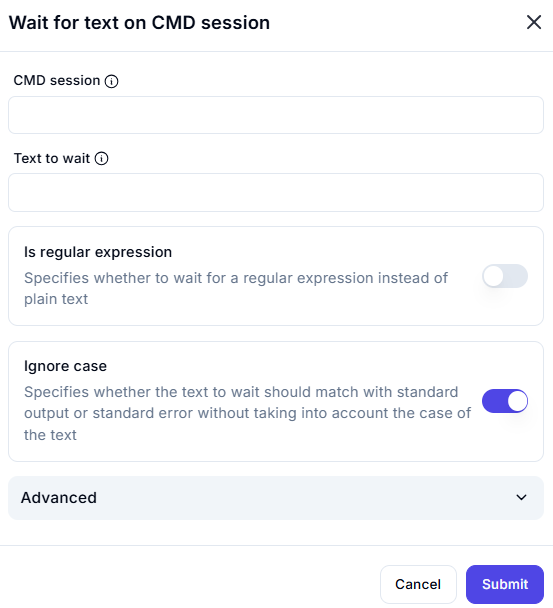

# **Wait for Text on CMD Session**

## Description

The **Wait for Text on CMD Session** action allows waiting for a specific text or pattern in an active CMD session before proceeding with further automation.

---

## **Features & Parameters**

| Parameter | Description | Example Value |
|-----------|------------|---------------|
| **CMD Session** | Specifies the active CMD session to monitor for output text. | `Session_1` |
| **Text to Wait** | The text or pattern to wait for in the CMD session output. | `Process Complete` |
| **Is Regular Expression** | If enabled, the text to wait for will be treated as a regular expression. | ❌ Disabled |
| **Ignore Case** | If enabled, the matching process will be case-insensitive. | ✅ Enabled |

---

## **How It Works**

1. **Select the CMD Session** – Choose the session where the text should appear.
2. **Enter the Text to Wait For** – Specify the expected output.
3. **Enable "Is Regular Expression"** (if needed) – Use regex patterns for advanced matching.
4. **Enable "Ignore Case"** (if necessary) – Match text regardless of capitalization.
5. **Click "Submit"** to begin monitoring.

---

## **Use Cases**

✔ Synchronizing automation with real-time CMD output  
✔ Waiting for process completion messages  
✔ Detecting error messages before proceeding  
✔ Using regex to match dynamic patterns in CMD logs  
