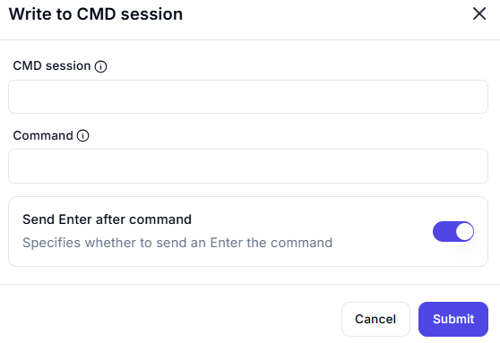

# **Write to CMD Session**

## Description

The **Write to CMD Session** action allows sending commands to an active command-line (CMD) session.

---

## **Features & Parameters**

| Parameter | Description | Example Value |
|-----------|------------|---------------|
| **CMD Session** | Specifies the active CMD session where the command will be executed. | `Session_1` |
| **Command** | The command to be sent to the CMD session. | `dir` |
| **Send Enter after Command** | If enabled, an Enter key will be sent after the command is executed. | ✅ Enabled |

---

## **How It Works**

1. **Select the CMD Session** – Choose an active session to send the command.
2. **Enter the Command** – Input the desired command to be executed.
3. **Enable "Send Enter after Command"** (if needed) – Ensures the command executes automatically.
4. **Click "Submit"** to send the command to the CMD session.

---

## **Use Cases**

✔ Running system commands dynamically  
✔ Automating command execution within an active CMD session  
✔ Interacting with scripts or batch processes via CMD  
✔ Sending multiple commands sequentially in an automation workflow  
