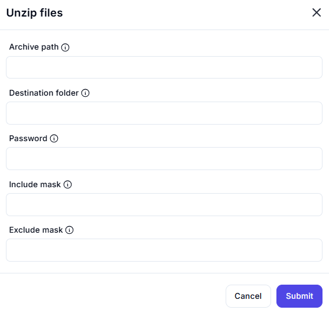

# Unzip Files Action Interface

## Description

This interface allows users to extract files from a ZIP archive.

## **Fields & Descriptions**

### **1. Archive Path**

- Specifies the location of the ZIP file to be extracted.  
- **Example:** `C:\Users\YourName\Documents\archive.zip`

### **2. Destination Folder**

- Specifies where the extracted files will be placed.  
- **Example:** `C:\Users\YourName\Documents\ExtractedFiles`

### **3. Password (Optional)**

- If the ZIP file is password-protected, enter the password here.  
- **Example:** `mypassword123`

### **4. Include Mask (Optional)**

- Allows extracting only specific files using patterns.  
- **Example:** `*.txt` (Extracts only `.txt` files)

### **5. Exclude Mask (Optional)**

- Excludes specific files from being extracted.  
- **Example:** `*.log` (Skips all `.log` files)

## **Use Cases**

✔ Extracting files from ZIP archives  
✔ Filtering extracted files based on patterns  
✔ Extracting password-protected archives  
