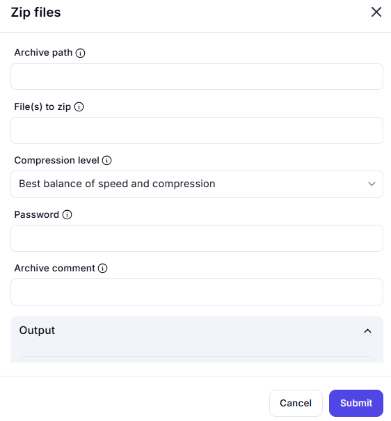

# Zip Files Action Interface

## Description

This interface allows users to create compressed ZIP archives.

## **Fields & Descriptions**

### **1. Archive Path**

- Specifies where the ZIP file will be saved.  
- **Example:** `C:\Users\YourName\Documents\archive.zip`

### **2. File(s) to Zip**

- List of files or folders to be compressed.  
- **Example:** `C:\Users\YourName\Documents\file1.txt, file2.docx`

### **3. Compression Level**

- Determines the balance between compression speed and file size.  
- **Options:**
  - **Best balance of speed and compression** (default)
  - **Fastest (larger file size, quicker compression)**
  - **Smallest size (slower compression, highest compression ratio)**

### **4. Password (Optional)**

- Protects the ZIP archive with a password.  
- **Example:** `mypassword123`

### **5. Archive Comment (Optional)**

- Adds metadata or notes to the ZIP file.  
- **Example:** `Backup of project files - February 2025`

### **6. Output**

- Displays the results or status of the ZIP operation.

## **Use Cases**

✔ Creating backups of important files  
✔ Compressing multiple files for easy sharing  
✔ Encrypting files with a password for security  
