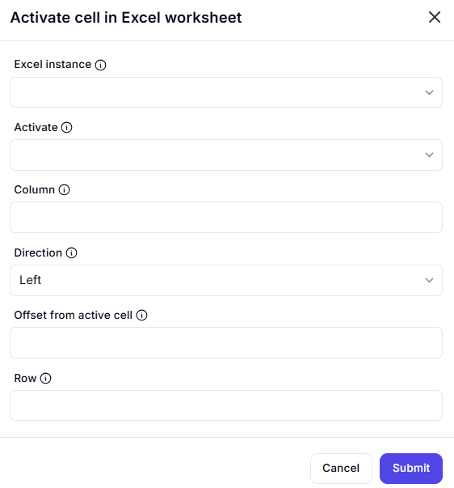

# Activate Cell in Excel Worksheet

## Description

This dialog allows users to activate a specific cell in an Excel worksheet, either by specifying a direct row and column reference or by using an offset from the currently active cell.

## Fields and Options

### 1. **Excel Instance** 🛈  

- A dropdown list where users select an active Excel instance.  
- Ensures that the action is performed on the correct workbook.  

### 2. **Activate** 🛈  

- A dropdown to select whether to activate a cell directly or via an offset.  

### 3. **Column** 🛈  

- A numeric input field for specifying the column number to activate.  
- Columns are usually numbered starting from `1`.  

### 4. **Direction** 🛈  

- A dropdown list for selecting the direction to move the active cell.  
- Options may include **Left, Right, Up, Down**.  

### 5. **Offset from Active Cell** 🛈  

- A numeric input field to define how many cells to move from the currently active cell.  
- Useful for relative positioning.  

### 6. **Row** 🛈  

- A numeric input field for specifying the row number to activate.  
- Rows are usually numbered starting from `1`.  

## Use Cases  

- Automating navigation within an Excel worksheet.  
- Selecting a specific cell before inserting or modifying data.  
- Moving the active cell position dynamically based on offset values.  

## Summary  

The **Activate Cell in Excel Worksheet** dialog provides an interface for selecting or moving to a specific cell within an Excel worksheet. Users can define activation by direct reference (row/column) or by relative movement from the currently active cell.  
