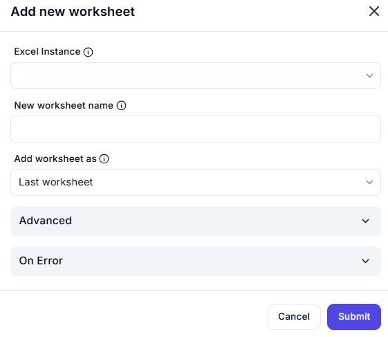

# Add New Worksheet  

## Description

This feature allows users to add a new worksheet to an Excel workbook. Users can specify the name of the new worksheet and its position within the workbook. It is useful for dynamically creating sheets during automation workflows.  

  

## Fields and Options  

### 1. **Excel Instance** 🛈

- Select the Excel instance (workbook) where the new worksheet will be added.  
- This ensures the action is performed on the correct workbook.  

### 2. **New Worksheet Name** 🛈

- Enter the name for the new worksheet (e.g., `Data`, `Report`, `Summary`).  

### 3. **Add Worksheet As** 🛈

- Choose the position of the new worksheet:  
  - **Last Worksheet**: Add the new sheet as the last sheet in the workbook.  
  - **First Worksheet**: Add the new sheet as the first sheet in the workbook.  
  - **After Specific Worksheet**: Add the new sheet after a specified worksheet.  

### 4. **Advanced** 🛈

- Configure additional settings for the new worksheet (e.g., formatting, default content).  

## Use Cases

- Dynamically creating new worksheets for data storage or reporting.  
- Adding sheets at specific positions in a workbook during automation.  
- Organizing workbooks with multiple sheets for better data management.  

## Summary

The **Add New Worksheet** action provides a way to add a new worksheet to an Excel workbook with customizable options for name and position. It ensures flexibility in managing worksheets during automation workflows.  