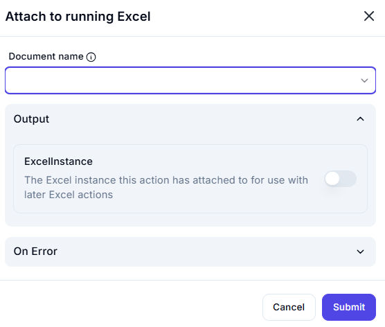

# Attach to Running Excel  

## Description

This feature allows users to attach to an already running instance of Microsoft Excel.  
It is useful for interacting with open workbooks without launching a new Excel instance.  

  

## Fields and Options  

### 1. **Document Name** 🛈

- Select the name of the open Excel document to attach to.  
- This ensures actions are applied to the correct workbook.  

### 2. **Output: ExcelInstance** 🛈

- A toggle option that, when enabled, stores the attached Excel instance for later use in automation.  
- This instance can be referenced in subsequent Excel actions.  

## Use Cases

- Automating tasks in an already open Excel file.  
- Avoiding multiple Excel instances by reusing an existing one.  
- Attaching automation to a user-controlled Excel session.  

## Summary

The **Attach to Running Excel** action provides a way to interact with open Excel workbooks efficiently.  
It helps in integrating automation with ongoing Excel tasks while ensuring a seamless workflow.  
