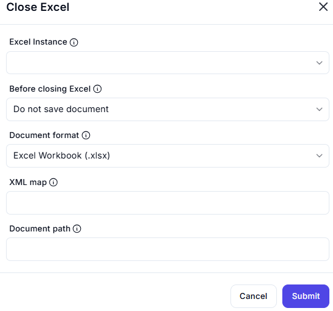

# Close Excel  

## Description

This feature allows users to close an Excel workbook or instance with options to save or discard changes. It is useful for ensuring that Excel instances are properly closed after automation tasks.  

  

## Fields and Options  

### 1. **Excel Instance** 🛈

- Select the Excel instance (workbook) to close.  
- This ensures the action is performed on the correct workbook.  

### 2. **Before Closing Excel** 🛈

- Choose what to do before closing the workbook:  
  - **Do not save document**: Close the workbook without saving changes.  
  - **Save document**: Save changes before closing.  

### 3. **Document Format** 🛈

- Select the file format for saving the workbook (e.g., `Excel Workbook (.xlsx)`).  

### 4. **XML Map** 🛈

- Specify an XML map if the workbook uses XML data mapping.  

### 5. **Document Path** 🛈

- Enter the file path where the workbook should be saved (e.g., `C:\Documents\Workbook.xlsx`).  

## Use Cases

- Closing an Excel workbook after automation tasks without saving changes.  
- Saving and closing a workbook in a specific format and location.  
- Ensuring proper cleanup of Excel instances after workflow execution.  

## Summary

The **Close Excel** action provides a way to close an Excel workbook with customizable options, including saving changes, document format, and file path. It ensures that workbooks are properly closed and resources are freed after automation tasks.
