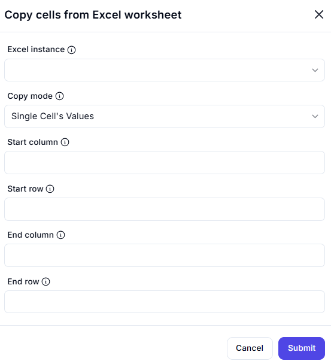

# Copy Cells from Excel Worksheet

## Description  

This dialog allows users to copy a range of cells from an Excel worksheet by specifying the start and end column and row values. The copied data can then be used for further processing or automation.

## Fields and Options  

### 1. **Excel Instance** 🛈

- A dropdown list to select the active Excel instance.  
- Ensures the operation is performed on the correct workbook.  

### 2. **Copy Mode** 🛈

- Defines the mode of copying. Options include:
  - **Single Cell's Values** – Copies values from a single cell.
  - **Values from a Range of Cells**
  - **Values from Selection**

### 3. **Start Column** 🛈

- Specifies the column index of the first cell in the range to be copied.  

### 4. **Start Row** 🛈

- Specifies the row index of the first cell in the range to be copied.  

### 5. **End Column** 🛈

- Specifies the column index of the last cell in the range to be copied.  

### 6. **End Row** 🛈

- Specifies the row index of the last cell in the range to be copied.  

## Use Cases  

- Copying data from an Excel sheet to be used in another worksheet or application.  
- Automating data extraction from specific cells in a structured format.  
- Processing a selected range of data for reporting or analysis.  

## Summary  

The **Copy Cells from Excel Worksheet** dialog provides an interface for copying values from an Excel sheet, either from a single cell or a defined range. Users can specify the start and end positions to ensure precise data selection for automation.  
