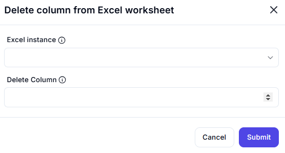

# Delete Column from Excel Worksheet

## Description  

This dialog allows users to delete a specific column from an Excel worksheet by specifying the column index. Once deleted, the columns to the right shift left automatically.

## Fields and Options  

### 1. **Excel Instance** 🛈

- A dropdown list to select the active Excel instance.  
- Ensures the operation is performed on the correct workbook.  

### 2. **Delete Column** 🛈

- Specifies the column index of the column to be deleted.  
- Once deleted, all columns to the right will shift left to maintain data structure.  

## Use Cases  

- Removing unnecessary data columns from an Excel worksheet.  
- Cleaning up a dataset by eliminating irrelevant or obsolete columns.  
- Automating data management processes by dynamically deleting columns.  

## Summary  

The **Delete Column from Excel Worksheet** dialog provides an easy way to remove unwanted columns, allowing users to manage Excel data efficiently. The feature ensures that the remaining columns shift left, keeping the structure intact.  
