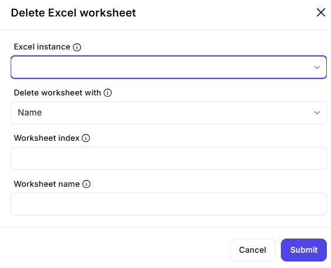

# Delete Excel Worksheet

## Description

This dialog allows users to delete a specific worksheet from an active Excel instance. The worksheet can be identified using either its name or index. Users must ensure they select the correct Excel instance before proceeding with the deletion.

## Fields and Options

### 1. **Excel Instance** 🛈  

- A dropdown list where users select an active Excel instance.  
- Ensures that the deletion is performed on the correct workbook.  

### 2. **Delete Worksheet With** 🛈  

- A dropdown allowing users to choose between deleting by **Name** or **Index**.  
- Selecting "Name" enables the **Worksheet Name** field.  
- Selecting "Index" enables the **Worksheet Index** field.  

### 3. **Worksheet Index** 🛈  

- A numeric input field for specifying the sheet index (if deletion by index is selected).  
- Indexing typically starts from `1`.  

### 4. **Worksheet Name** 🛈  

- A text input field for specifying the sheet name (if deletion by name is selected).  
- The name should match exactly as it appears in Excel.  

## Use Cases  

- Removing obsolete or temporary worksheets from an Excel workbook.  
- Cleaning up data by deleting unnecessary sheets before exporting or processing.  
- Automating worksheet management in large workbooks.  

## Summary  

The **Delete Excel Worksheet** dialog provides a simple interface for users to remove a worksheet from a selected Excel instance. The deletion can be performed using either the worksheet’s name or index, allowing flexibility in automation workflows.  
