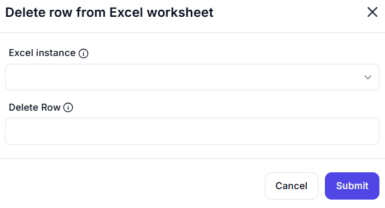

# Delete Row from Excel Worksheet

## Description  

This dialog allows users to delete a specific row from an Excel worksheet based on the given row index.

## Fields and Options  

### 1. **Excel Instance** 🛈

- A dropdown list to select the active Excel instance.  
- Ensures the operation is performed on the correct workbook.  

### 2. **Delete Row** 🛈

- Specifies the row index of the row to be deleted.  
- Once deleted, rows below the specified index will shift up automatically.  

## Use Cases  

- Removing unwanted or outdated data from an Excel worksheet.  
- Automating data cleanup processes.  
- Managing structured data by dynamically deleting specific rows.  

## Summary  

The **Delete Row from Excel Worksheet** dialog provides an efficient way to remove a specific row from an Excel sheet. This feature helps automate data management and cleanup processes within structured spreadsheets.  
